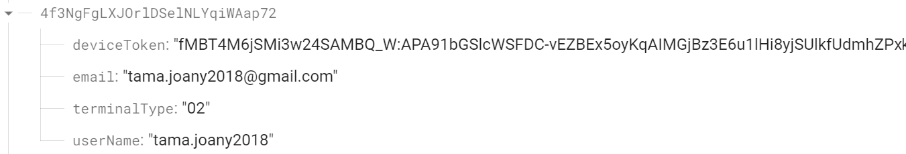
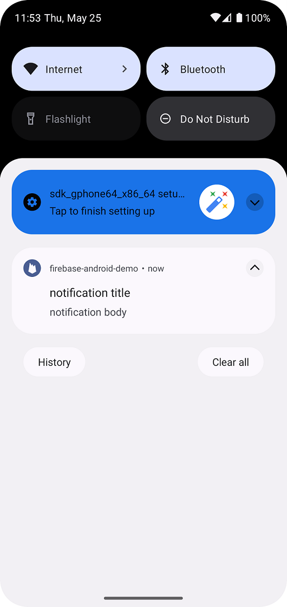

# firebase-android-demo

## 前提準備  
  1.Android プロジェクトに Firebase を追加する　[参照](https://firebase.google.com/docs/android/setup)    
　* 前提条件  
　* オプション 1: Firebase コンソールを使用して Firebase を追加する 

  2.Firebase 構成ファイルを保存する   
　  上記でダウンロードしたgoogle-services.jsonファイルを本プロジェクトの[app/]に保存する。  

  3.Firebase Authenticationを設定する  
　　* <a href="https://console.firebase.google.com/">Firebase コンソール</a>で、[Authentication] セクションを開く。  
　　* [Sign-in method] タブで [メール / パスワード] を有効にして、[保存] をクリックする。  
　　* [Users] タブで[ユーザーを追加]でユーザーを追加する。  

 4.データベースを作成する　[参照](https://firebase.google.com/docs/database/android/start)    
　　* データベースを作成する。  

## 説明
  本プロジェクトは、登録したユーザーのデバイスtokenを取得し、ユーザー情報と共にデータベースに保存し（usersの下）、通知メッセージを受信する。

## 実行  
　1.アプリを起動する。  
　2.[Authentication]で追加されたユーザーで[Sign In]、 又は追加されてないユーザーで[Sign Up]  
　3.データベースのデータを確認する。  
   
  4.(spring-boot-firebase-demo)から通知メッセージを受信する。   
    

### アプリ起動について設定
　1.Android SDK 設定：   
  　パス：File > Settings > Appearance $ Behavior > System Settings > Android SDK  
  　SDK Platforms: Android 13.0  インストール   
  　SDK Tools:  Android Auto *,Android Emulator, Android SDK Platform-Tools, Google Play * インストール    
  2.JDK Location変更 (sun証明書エラーの場合)：   
  　パス：File > Project Structure > SDK Location   
  　JDK Location(Gradle Settings): ローカルPCのJDK  
  3.Device 追加：  
  　パス：Tools > Device Manager > Create Device    
      
  